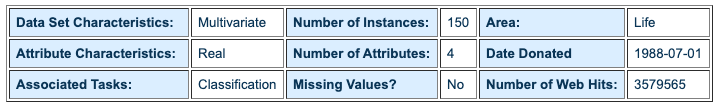
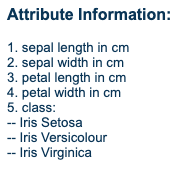

## Analysis:

### Which species of iris has the longest petals (on average)?

Iris Viriginica has the largest average petal length, with a measurement of 5.552 cm.

### Which species of iris has the widest sepals (on average)?

Iris Setosa has the largest average sepal width, with a measurement of 3.418 cm. 

### Process in finding the above results:

The iris.csv dataset I used showed the attributes of sepal length, sepal width, petal length, petal width, and species for 150 iris plants. This dataset came from the [UCI machine learning repository](https://archive.ics.uci.edu/ml/datasets/Iris).

Here is some of the dataset information I used from the [publisher's website](https://archive.ics.uci.edu/ml/datasets/Iris): 





First, I knew that I was looking for the Iris species with the longest petals and widest sepals, so I thought it would be important to focus on the attributes of petal length and sepal width in the iris dataset. I created two empty dictionaries, which would include all of the values for petal length and sepal width in the dataset, organized by species. Each dictionary contained the three Iris species as keys and empty lists as values. In order to populate the dictionary, I imported csv to read the data in the iris.csv file. I iterated through the rows of data (aside from the header):

``` python
for row in data:
        petal_lengths[row[4]].append(float(row[2]))
        sepal_widths[row[4]].append(float(row[1]))
```

petal_lengths and sepal_widths are the two dictionaries I dicussed earlier, which contain the Iris species as their keys. The fourth index of a row would be the Iris species name in the iris.csv dataset, so `petal_lengths[row[4]]`, for instance, would refer to value of petal_lengths with the key of the species of a given plant (row) in the data. I would then append the the petal length of the plant, the second index of the row, to the list for its species in petal_lengths. I repeated the same process with the sepal_widths dictionary, except I would append the sepal width, the first index of a row, instead of the petal length to the value list for each species. At the end of the for loop, I would have two dictionaries containing all of the petal length and sepal width values as lists for each species. 

**Finding the averages:**

With my petal length and sepal width data organized by species, my next step was to find the average petal length and sepal width for each species. I created a function to help me find the averages:

```python
def find_avg(iris_lst):
    sum = 0
    for i in iris_lst:
        sum += i
    return sum/len(iris_lst)
``` 

The function takes a list as a parameter and returns the average of that list. It iterates through all of elements of the list and adds them to a sum variable, which is then divided by the list's length to find the average. I created two new dictionaries for petal length and sepal width, using the species as keys and the average petal length or sepal width for that species as values. Each value of the new dictionaries uses the list of its corresponding species in the first dictionary to become the average of that list with the find_avg function. 

**Finding the greatest petal length and sepal width:**

At this point, I had averages for petal length and sepal width for each species in two dictionaries. I wanted to find the species with the largest average petal length and sepal width, so I created another function to find out which value was the maximum in each dictionary:

```python
def find_max(iris_dict):
    max = 0 
    name_iris = "" 
    for i in iris_dict: 
        if iris_dict[i] > max: 
            max = iris_dict[i]
            name_iris = i 
    return name_iris + " : " + str(max)
```
The function takes a dictionary as a parameter and returns the maximum value and key of that value in the dictionary.  It works by iterating through the keys in the dictionary, checking if the value for that key is greater than the max variable, which starts at zero (no values in the iris.csv dataset were below zero). If the value in the dictionary is greater than the max, then the max becomes equal to that value, so the max variable will eventually be equal to the maximum value in the dictionary. I used this function on both the average petal length and average sepal width dictionaries in order to find their maximum values. I printed the outputs to the console, which allowed me to see the maximum petal length and sepal width, along with which species (key) had that maximum.

**What I learned**

I learned how to read data from a csv in Python, as well as how I could process and analyze that data. I found out that dictionaries are a very useful way to organize data for later use, and I also learned a much more efficient way to create those dictionaries from the dataset. I had initially tried to make the attributes into lists, which I would then place as values in a dictionary, as opposed to immediately inserting each data point into the dictionary as I iterated through the rows. I figured out that the keys in the dictionary could be the same strings as the species names in the dataset, so I could use the species name to refer to the values in the dictionary, then append each data point as I iterated through the dataset.


