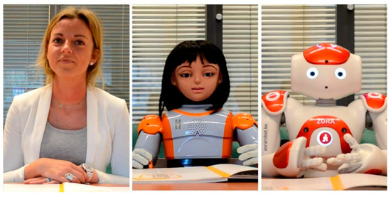

Robots are becoming more prevalent, and the ability of a robot to express more humanーlike emotions may influence the degree to which it can emulate human interaction. In this [study on robot facial articulacy](https://www.mdpi.com/2218-6581/9/4/92/htm#B46-robotics-09-00092), the researchers examined how people empathized with videos of a human actress, a robot with a static face, and a robot with more facial plasticity. They found that subjects had greater emotional responsiveness to video clips of the plastic robot than the static robot, especially when the emotions shown were more negative, but the subjects still had a high level of responsiveness to all three options. Humans that saw robots exhibit different expressions would make internal inferences about that robot's emotional state, which seemed to override their cognitive understanding that the robots could not actually feel emotion. 

*From left to right: human actress, robot Alice (facially articulate), robot Nao/Zora (facially static)*

#### 1. Identify a statistical question that you could ask.

How would people rate an everyday interaction with a robot differently, depending the extent to which that robot could replicate human emotion in its body language, voice, and face? 

#### 2. Identify the population you would study to answer the question. What information about the population would help answer your question?

The population would be all humans. Important information on the population would include the participant's geographical location, their daily use of technology, and their age.

#### 3. Identify a feasible sample frame, and explain your reasoning.

In obtaining a sample frame, I believe that the best method would involve inviting people from various locations around the world. However, because participants would need to appear in person to conduct the experiment, a more feasible option may be inviting people from a single location. For this sample frame, I would email around 1,000 people from across New York, which has a relatively diverse population. Instead of considering geographical location as an attribute of the population, I could consider the countries where that person has lived, as the geographical location would be similar for all participants. 

#### 4. Identify the sampling method you would use, and explain your reasoning. What makes this method better than the others?

By default, the sampling would be voluntary, given that all of the people emailed would choose whether or not to participate in the study. In deciding which people I email, I could employ simple random to select the 1,000 people from the email addresses available. Even assuming that I had access to the information I was interested in for all of the people,I do not think that any of the attributes (mentioned in number 2) would significantly influence the results. Thus, although I believe that that information is useful to note, I do not feel that groups based on those categories would be beneficial to consider when sampling, leading me to select simple random over the other probability-based methods. Second, I think that simple random is better than the non probability-based methods due to increasing the likeliness of including a wider variety of subjects.

#### 5. Suppose you had the means to run an experiment on this sample. Identify the null and alternative hypotheses.

Null: Robots with a greater ability to physically express emotion will not create a more satisfactory experience than those without it. 

Alternative: The extent to which a robot could physically express emotion correlated with the rating it received from participants.

#### 6. Identify the variables and treatments that would provide information about your question. Explain your choice of treatments.

I would use five different treatments, one of which is a control. Each treatment involves a robot/human interacting with a customer in a simulated hotel employee scenario. According to the original study, this is one of the real-life situations where people have begun to use robots for assistance. The independent variables are one, the type of robot used, and two, the type of programming given to the robot. One of the robots will have a static face, and the other robot will have a more articulate and human-like face, as in the original study. The two robots will either be programmed to express emotion to the best of their ability, using mechanisms such as body language and tone of voice (if possible), or they will remain relatively still and speak in a monotone voice. The dependent variable will be the rating decided by the participants, who are acting as the customers. In the first two treatments, the facially static robot will talk to the customer using each of the two programming settings. The second two treatments will use each of the two programming settings for the facially articulate robot. The final treatment will have the customer interact with a human actress as the employee, allowing us to get an idea of how the customer's ratings will work in a more familiar situation. 

#### 7. Identify the treatment groups, and how each subject would be assigned to a group.

There would be five treatment groups, one for each of the treatments. As with sampling, I think that sorting customers randomly into groups would be the best method. I do not think that any attributes of the population would significantly impact the ratings a person is likely to give, so the members of each treatment would be assigned at random.

#### 8. Briefly discuss how the experiment would be conducted.

Participants will be asked to check into a hotel room and make a reservation when speaking with an unknown employee, and then they will give a verbal explanation of their satisfaction with their experience, which I would then convert into a number on a 10 point scale, based on factors such as the ease and comfort of the interaction. The employee they speak to will be one of the two types of robots with either programming setting, or it will be the human actress. In total, there are five possible scenarios defined by the five treatments. 

#### 9. What biases may come up, and how would you address them?

I believe that the most prevalent bias would be the difficulty of having a standard for ratings. Some people may tend to be more easily satisfied than others, especially when considering the varying degrees to which they may be familiar with the given situation. It also may be difficult for the researchers to consistently convert the explanation to a number, though I think that this method may still be better than having customers give their own numerical rating. Instead of having ratings based on the participant's stated satisfaction, the researchers could potentially observe the participant's responses and reactions during the scenario, then assign a rating based on those. Second, the robots may have unrelated issues that would influence ratings, such as difficulty understanding what the participants say. Before conducting the study, I would have to ensure that the robots have the same functionality aside from the aspects we are varying, and I could also perform a test to find out which accents the robots understand the most easily. In terms of biases outside of the experiment, exclusion bias would limit the accuracy of my conclusions. The population is already challenging to represent, given that almost all humans could relate to a robot/human differently depending on their ability to express emotion. With more resources, I think that a better way to conduct the experiment would be holding the experiment in various countries around the world, changing the voice language and potentially body language of the robot for different locations. 