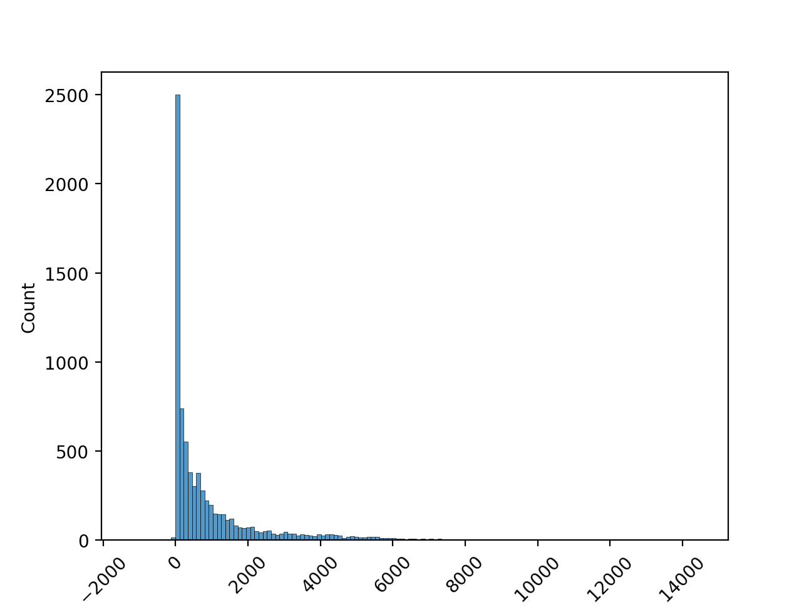
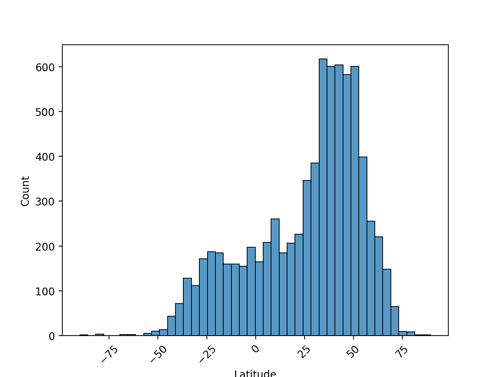
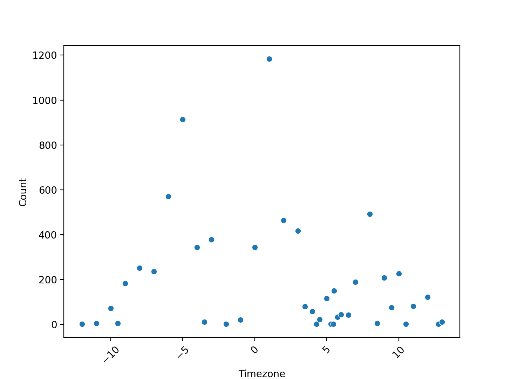

#### Which dataset did you work with?

I decided to work with the dataset containing information on airports from [OpenFlights](https://openflights.org/data.html).

#### Data Analysis:

During my process of data analysis, I found that I most often focused on the amount of airports existing in a particular location or fitting a particular condition. The dataset mainly provided information on specific airports, so in terms of searching for trends and relationships, I thought that airport counts may be a useful statistic to center my analysis on. 

I first wanted to examine the amount of airports present in certain countries and cities, but the visualizations I attempted to make for them contained too many labels even when further filtering the data. I decided that I could instead present this categorical information through text, and using functions to do so allowed me to examine some additional factors, such as the amount of cities with a particular amount of airports. For this section of my analysis, I looked at the airport amounts in US cities filtered by timezone, which I used to help make the information more digestible by focusing individually on different sections of the United States:

```
United States Eastern Timezone (UTC-5)
Count 1 airport(s): 405 cities
Count 2 airport(s): 32 cities
Count 3 airport(s): 15 cities
Count 4 airport(s): 2 cities
Count 5 airport(s): 2 cities
Total: 456 cities
Most airports (5): 
['Atlanta', 'New York']

United States Central Timezone (UTC-6)
Count 1 airport(s): 271 cities
Count 2 airport(s): 27 cities
Count 3 airport(s): 6 cities
Count 4 airport(s): 2 cities
Count 6 airport(s): 1 cities
Total: 307 cities
Most airports (6): 
['Houston']

United States Mountain Timezone (UTC-7)
Count 1 airport(s): 129 cities
Count 2 airport(s): 10 cities
Count 3 airport(s): 1 cities
Count 4 airport(s): 1 cities
Total: 141 cities
Most airports (4): 
['Tucson']

United States Pacific Timezone (UTC-8)
Count 1 airport(s): 147 cities
Count 2 airport(s): 7 cities
Count 3 airport(s): 5 cities
Count 4 airport(s): 1 cities
Total: 160 cities
Most airports (4): 
['Sacramento']

United States Alaska Timezone (UTC-9)
Count 1 airport(s): 164 cities
Count 2 airport(s): 6 cities
Count 4 airport(s): 1 cities
Total: 171 cities
Most airports (4): 
['Anchorage']

United States Hawaii-Aleutian Timezone (UTC-10)
Count 1 airport(s): 20 cities
Count 2 airport(s): 1 cities
Total: 21 cities
Most airports (2): 
['Molokai']
```

For each US timezone, the counts of airports and amounts of cities with that count are listed in ascending order. The total cities and the specific cities with the greatest number of airports in a particular region are also included. 

In the next section of my analysis, I decided to individually look at the variables of altitude and latitude. I thought that these numerical variables may be some of the most interesting for considering summary statistics and trends, as many of the other labels were more categorical, such as the codes and ID for a certain airport. I first showed the distributions for both of these variables:




These are the summary statistics for each variable:

```
Summary Statistics for the Altitudes of World Airports:
count     7698.000000
mean      1015.873344
std       1628.775132
min      -1266.000000
25%         63.000000
50%        352.000000
75%       1203.000000
max      14472.000000
Name: Altitude, dtype: float64

Summary Statistics for the Latitudes of World Airports:
count    7698.000000
mean       25.808442
std        28.404946
min       -90.000000
25%         6.907983
50%        34.085701
75%        47.239551
max        89.500000
Name: Latitude, dtype: float64
```
In the last section of my analysis, I wanted to examine correlation in the dataset. Because the labels in the dataset were used to describe each airport, such as latitude, longitude, altitude, and timezone, I thought that comparing these qualities to one another would not provide much insight on the airports themselves. I instead used functions to create a new dataframe, which included timezones and the counts of airports at each of those timezones. Out of the ordinal data available in the dataset, I thought that timezone may be the best way to find trends in the airports present throughout particular regions. Using this dataframe, I made a scatterplot visualization for the data:



I also looked at the dataframe and correlation between timezone and airport counts:
```
Count of Airports by each Timezone:
    Timezone  Count
0     -12.00      1
1     -11.00      4
2     -10.00     71
3      -9.50      4
4      -9.00    182
5      -8.00    251
6      -7.00    236
7      -6.00    569
8      -5.00    914
9      -4.00    343
10     -3.50     11
11     -3.00    378
12     -2.00      1
13     -1.00     20
14      0.00    344
15      1.00   1184
16      2.00    464
17      3.00    416
18      3.50     79
19      4.00     57
20      4.30      1
21      4.50     21
22      5.00    115
23      5.30      1
24      5.45      1
25      5.50    149
26      5.75     33
27      6.00     43
28      6.50     42
29      7.00    189
30      8.00    492
31      8.50      4
32      9.00    208
33      9.50     75
34     10.00    226
35     10.50      1
36     11.00     81
37     12.00    122
38     12.75      1
39     13.00     11

Correlation between Timezone and Airport Count:
          Timezone     Count
Timezone  1.000000 -0.178012
Count    -0.178012  1.000000
```

#### Conclusions:

While much of the data was more relevant to describing specific airports than to looking at airports overall, I still found some noticeable trends through my analysis. When grouping airports by city, as I did with the US in the first section of my analysis, the cities with the most airports were often populous cities or state capitals. Looking at the summary statistics and distribution for altitude, many airports have altitudes in the lower range, but some of the higher values are extremely large. The median, at 352 feet, is about 700 feet lower than the mean and the maximum is almost 15,000 feet, which shows that the data may have some very great outliers. This is further shown by how 25% percent of airports lie between 1203 ft and the maximum. For latitude, I was surprised to see that this aspect of an airport's geography could have a clear trend. More airports seem to lie in the Northern hemisphere, which makes sense considering that, according to [Engaging Data](https://engaging-data.com/population-latitude-longitude/), the highest population occurs at 25-26 degrees North. In the summary statistics, the median was slightly higher than the mean, both of which were above the equator, showing the higher values to be more common. The mean was 25.8 degrees North, showing that the amount of airports may have a strong correlation to population. In the last section of my analysis, timezone did not have much of a correlation with airport count, but the timezones closer to UTC still tended to have more airports. I think that this makes sense because while timezone is not categorical, considering that two timezones being close together would have significance, a timezone being high or low does not demonstrate anything in particular about the region or population of that timezone. 